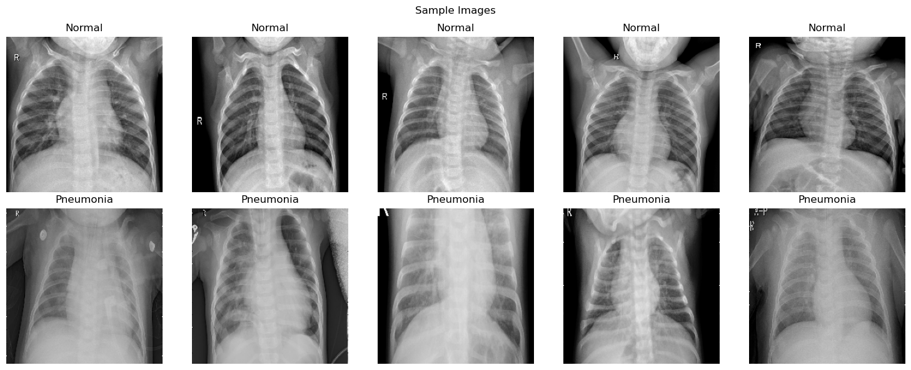
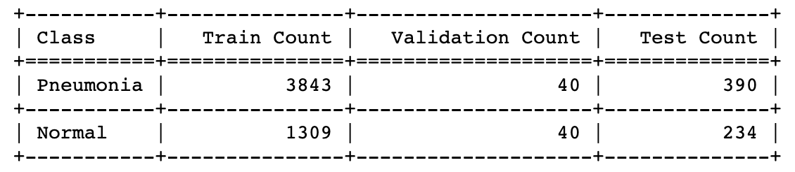

# Chest-X-Ray-Image-Classification
***
Machine learning project detecting Pneumonia in chest X-rays. 

**Author:** [Emmi Galfo](mailto:emmi.galfo@gmail.com)

## Project Summary
In this project, I tackled the business problem of developing an AI-powered system to detect pneumonia in chest X-ray images for a medical technology company. The data used for this task consisted of a large dataset of labeled chest X-ray images, with two classes, "Pneumonia" and "Normal." The dataset was well-suited for the business problem, as it provided a diverse sample of X-rays that included both viral and bacterial pneumonia cases as well as pneumonia free cases.

For data preparation, I utilized the Keras library to ensure uniformity in image sizes and enhance model performance by resizing images to 224x224 pixels and normalizing pixel values to a range between 0 and 1. 

In the modeling phase, I implemented Convolutional Neural Networks (CNNs) and transfer learning techniques. For the CNNs, I used multiple convolutional and max-pooling layers for detecting simple patterns such as edges and corners, followed by dense layers for high-level reasoning and classification. For transfer learning, I leveraged the pre-trained model, Xception, and fine-tuned top Dense layers on the X-ray dataset. 

To evaluate the models, I used binary cross-entropy loss, model accuracy, and recall as relevant metrics. The data was split into training and validation sets to assess model generalization. The models where then evaluated on an unseen test set. The final transfer learning model was the most successful. It not only achieved the highest accuracy of 84%, but also it had an excellent recall score of 98% and the highest avg weighted recall score of the models at 84%. 

Overall, the project successfully addressed the business problem by delivering an AI-powered pneumonia detection system that can be integrated into the company's medical imaging products. 

## Business Problem
A medical technology company wants an AI-powered system that detects pneumonia in chest X-rays. They have hired me to develop a model that can be implemented into their medical imaging products in order to assist radiologists with reading X-rays and flagging potential cases of pneumonia. The goal is to provide radiologists with cutting-edge technology that can aid them in interpreting X-rays accurately and efficiently, leading to quicker and more accurate diagnoses.

## Data Understanding
The dataset used in this project was downloaded from kaggle.com. It consists of chest X-ray images categorized into two classes, "Pneumonia" and "Normal." The data provides a diverse range of X-rays, allowing the model to learn patterns and features related to pneumonia detection. With 5,863 labeled images, the dataset is sufficiently large enough to train a robust model.

This disparity in class representation raises concerns about class imbalance. In machine learning and deep learning tasks, class imbalance can impact model performance and bias the predictions towards the majority class. In this dataset, the "Pneumonia" class is the majority class, while the "Normal" class is the minority class. This is something that I will keep in mind when evaluating my models. There are techniques I can implement such as creating synthetic data to add to the normal set to offset the imbalance; however, I am more concerned with classifying pneumonia correctly than miss-classifying healthy X-rays. I will keep in mind the imbalance when looking at the results and for now see how my models perform. 

## Modeling

