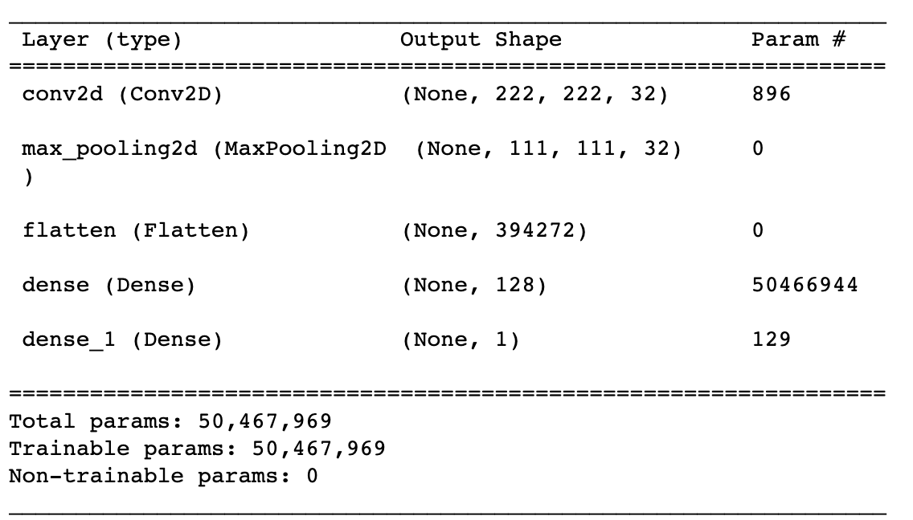
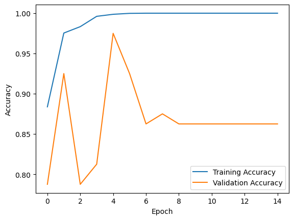
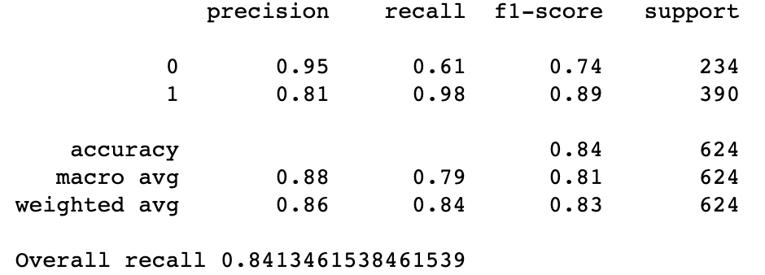
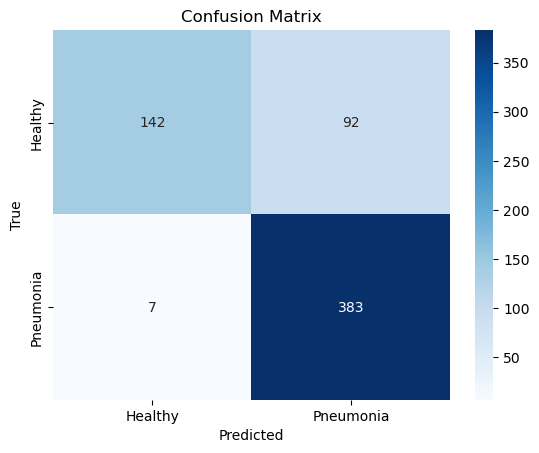
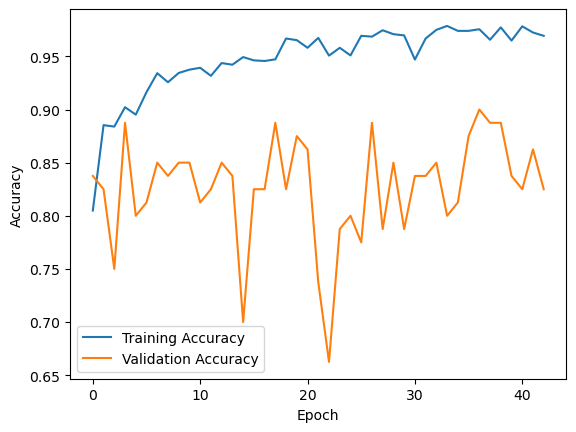

# Pneumonia Detection in Chest X-Rays

Convolutional Neural Network (CNN) project detecting Pneumonia in chest X-rays. 

**Author:** [Emmi Galfo](mailto:emmi.galfo@gmail.com)

## Project Summary
In this project, I tackled the business problem of developing an AI-powered system to detect pneumonia in chest X-ray images for a medical technology company. The data used for this task consisted of a large dataset of labeled chest X-ray images, with two classes, "Pneumonia" and "Normal." The dataset was well-suited for the business problem, as it provided a diverse sample of X-rays that included both viral and bacterial pneumonia cases as well as pneumonia free cases.

For data preparation, I utilized the Keras library to ensure uniformity in image sizes and enhance model performance by resizing images to 224x224 pixels and normalizing pixel values to a range between 0 and 1. 

In the modeling phase, I implemented Convolutional Neural Networks (CNNs) and transfer learning techniques. For the CNNs, I used multiple convolutional and max-pooling layers for detecting simple patterns such as edges and corners, followed by dense layers for high-level reasoning and classification. For transfer learning, I leveraged the pre-trained model, Xception, and fine-tuned top Dense layers on the X-ray dataset. 

To evaluate the models, I used binary cross-entropy loss, model accuracy, and recall as relevant metrics. The data was split into training and validation sets to assess model generalization. The models where then evaluated on an unseen test set. The final transfer learning model was the most successful. It not only achieved the highest accuracy of 84%, but also it had an excellent recall score of 98% and the highest avg weighted recall score of the models at 84%. 

Overall, the project successfully addressed the business problem by delivering an AI-powered pneumonia detection system that can be integrated into the company's medical imaging products. 

## Business Problem
A medical technology company wants an AI-powered system that detects pneumonia in chest X-rays. They have hired me to develop a model that can be implemented into their medical imaging products in order to assist radiologists with reading X-rays and flagging potential cases of pneumonia. The goal is to provide radiologists with cutting-edge technology that can aid them in interpreting X-rays accurately and efficiently, leading to quicker and more accurate diagnoses.

## Data Understanding
The dataset used in this project was downloaded from kaggle.com. It consists of chest X-ray images categorized into two classes, "Pneumonia" and "Normal." The data provides a diverse range of X-rays, allowing the model to learn patterns and features related to pneumonia detection. With 5,863 labeled images, the dataset is sufficiently large enough to train a robust model.

This disparity in class representation raises concerns about class imbalance. In machine learning and deep learning tasks, class imbalance can impact model performance and bias the predictions towards the majority class. In this dataset, the "Pneumonia" class is the majority class, while the "Normal" class is the minority class. This is something that I will keep in mind when evaluating my models. There are techniques I can implement such as creating synthetic data to add to the normal set to offset the imbalance; however, I am more concerned with classifying pneumonia correctly than miss-classifying healthy X-rays. I will keep in mind the imbalance when looking at the results and for now see how my models perform. 

## Modeling
I will be using CNN (Convolutional Neural Networks) for this project because they are well-suited for image recognition tasks, allowing me to efficiently detect patterns and features in the chest X-ray images.

### Baseline Model

#### Model Evaluation

I used the test dataset to assess the model's generalization ability on unseen data. The model achieved an accuracy of 79.33% on the test set, and a loss of 0.95 demonstrating its overall correctness in predicting both classes.

The confusion matrix provided insights into the model's performance by revealing the true positive, true negative, false positive, and false negative predictions for each class. 
True Positive (TP): The model correctly identified 387 Pneumonia cases as positive instances.
True Negative (TN): The model correctly identified 108 Normal cases as negative instances.
False Positive (FP): The model misclassified 126 Normal cases as Pneumonia, leading to false positives.
False Negative (FN): The model missed 3 Pneumonia case, resulting in false negatives.

Moreover, the model achieved a recall (true positive rate) of 0.99 for Pneumonia cases in the test set, indicating its strong ability to correctly identify positive cases. However, the recall for Normal cases was only 0.46, suggesting room for improvement in correctly recognizing Normal cases. The overall accuracy was 79%.

Additionally, the area under the Receiver Operating Characteristic curve (ROC AUC score) for the test set was 0.93. The ROC curve illustrates the model's performance across various classification thresholds, and an AUC score closer to 1 indicates better discriminatory power. The achieved score of 0.93 indicates good model performance in distinguishing between Pneumonia and Normal cases. 

Overall, the baseline CNN model demonstrated promising results, particularly in identifying Pneumonia cases accurately. However, it showed some limitations in correctly classifying Normal cases. Fine-tuning the model or exploring different architectural adjustments may further enhance its performance on the test set and improve its sensitivity to Normal cases.

***

### Final Model

#### Model Evaluation:
The final model, was built upon transfer learning with the Xception model's base layers, followed by custom dense layers for Pneumonia detection. The patience level was raised from 10 to 25 with the hope that the model would have more time to converge. 

When evaluating Model 5 on the test set, it achieved an accuracy of 84.13% which is the highest accuracy of any of the models as well as a loss value of 0.69 which is similiar to model 4. The final model did run for more epochs than model 4, and the higher accuracy suggests that the higher patience level improved the model's performance.

The confusion matrix for model 5 provided the following insights into its performance:

True Positive (TP): The model correctly identified 383 Pneumonia cases as positive instances.
True Negative (TN): The model correctly identified 142 Normal cases as negative instances.
False Positive (FP): The model misclassified 92 Normal cases as Pneumonia, leading to false positives.
False Negative (FN): The model missed seven Pneumonia cases, resulting in false negatives.

Analyzing the recall, the model still demonstrates excellence in correctly identifying Pneumonia cases with a recall of 0.98. Moreover, it shows better performance for Normal cases with a recall of 0.61 compared to previous models. The accuracy went up to 0.84. 

Furthermore, the ROC AUC score for the test set is 0.94. This high ROC AUC score, while similiar to all the other models', confirms the model's ability to effectively differentiate between the two classes and is an essential metric for evaluating the final model's performance.

In conclusion, the final model with transfer learning from Xception shows significant improvement from the baseline model, accurately detecting both Pneumonia and Normal cases. The model's robustness is reflected in its high accuracy and good recall for both classes. These results are promising and showcase the potential of deep learning models in contributing to the advancement of medical image analysis for Pneumonia detection.

***

## Results and Conclusions
Results:
In this project, I applied Convolutional Neural Networks (CNNs) and transfer learning techniques to develop and evaluate several models for the task of Pneumonia detection from X-ray images. Five different models were implemented and compared, each with varying architectures and hyperparameters.

Model Performance Summary:
1. Model 1 achieved an accuracy of 79.33% on the test set, with an overall recall of 0.7933. It showed promising results in identifying Pneumonia cases accurately but had room for improvement in recognizing Normal cases.

2. Model 2 demonstrated an accuracy of 73.00% on the test set, with an overall recall of 0.73. This model showed lower accuracy and overall recall than the baseline while maintaining a high recall for Pneumonia cases. 

3. Model 3, demonstrated an accuracy of 82.00% on the test set, with an overall recall of 0.8205. This model showcased improved performance in correctly identifying Normal cases while maintaining a high recall for Pneumonia cases.

4. Model 4, was based on Xception's base layers and fine tuned on Dense layers. Besides demonstrating a significantly lower loss score on the test set, it attained similiar results to Model 3 with an accuracy of 82.05% on the test set, with an overall recall of 0.82.

5. Model 5, the final model, also based on Xception's base layers, was trained with a higher patience level than the other models allowing for a longer convergence time during training. It achieved an accuracy of 84.13% on the test set, with an overall recall of 0.84. It yielded the best results overall and a significant improvement from the baseline model. 

Conclusions:
* The transfer learning with Xception's base layers and a longer patience level significantly enhanced the performance of Pneumonia detection from X-ray images. The final model demonstrated superior accuracy and recall compared to the baseline model. The use of pre-trained model enabled the final model to leverage rich learned features from large-scale datasets, leading to improved generalization and robustness.

* The experimentation with hyperparameters, such as patience level and dropout rates, provided valuable insights into model training and convergence. Adjusting these parameters allowed me to fine-tune the models, leading to more optimal performance.

* The final AI-powered pneumonia detection model represents a significant step forward in assisting radiologists with accurate and efficient interpretation of chest X-rays. 

* The developed model's success in detecting pneumonia showcases its potential to empower healthcare professionals with advanced AI-driven solutions.

* There are limitations to be addressed to further optimize the model's performance. The class imbalance between Normal and Pneumonia cases remains a challenge, and future work should focus on methods such as weighted regularization and data augmentation to alleviate this issue. 

* Additionally, further regularization techniques can be explored to prevent overfitting and enhance the model's generalization on diverse datasets. 

***
Thank You!
emmi.galfo@gmail.com
***

## Repository structure: 
├── Images : images used in readme, presentation, and notebook \
├── EDA-Modeling-Evaluation.ipynb : jupyter notebook used to create project \
├── README.md : project summary and conclusions \
├── Pneumonia_Detection_Presentation.pdf : stakeholder powerpoint slides 

